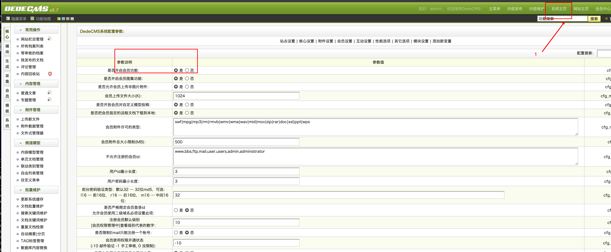
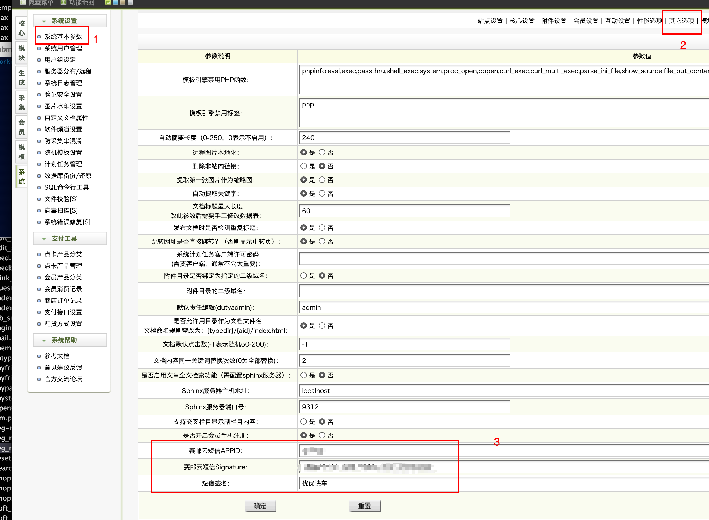

## OVERVIEW

### Dedecms Plug-Ins Overview

>织梦CMS是集简单、健壮、灵活、开源几大特点的开源内容管理系统。

------
Dedecms  [官网地址](http://www.dedecms.com/)

How to use

-	member/templets/js/reg_new.js
-	member/templets/reg-new.htm
-	member/index_do.php
-	member/lib_sms.php
-	member/reg_new.php
-	member/reg_news.php
-	member/member.sql


使用方法

    把下载好的Dedecms赛邮云插件程序解压覆盖到网站根目录

登录后台管理界面
	选择系统 -> 会员设置 -> 在是否开启会员功能选择“是”,保存。

	在系统-> sql命令行工具 –> 多行命令 –> 填写sql语句 –> 确认执行。把需要的信息写入数据库中。


>sql语句如下：
``` sql
	ALTER TABLE `dede_member` ADD `phone` CHAR( 11 ) CHARACTER SET utf8 COLLATE utf8_unicode_ci NULL;
	INSERT INTO `dede_sysconfig` (`aid`,`varname`,`info`,`groupid`,`type`,`value`)VALUES (
	'9660','cfg_mobile_reg','是否开启会员手机注册','7','bool','Y');
	INSERT INTO `dede_sysconfig` (`aid`,`varname`,`info`,`groupid`,`type`,`value`)VALUES (
	'9661','cfg_smsbao_name','赛邮云短信APPID','7','string','');
	INSERT INTO `dede_sysconfig` (`aid`,`varname`,`info`,`groupid`,`type`,`value`)VALUES (
	'9662','cfg_smsbao_password','赛邮云短信Signature','7','string','');
	INSERT INTO `dede_sysconfig` (`aid`,`varname`,`info`,`groupid`,`type`,`value`)VALUES (
	'9663','cfg_smsbao_sign','短信签名','7','string','');
	DROP TABLE IF EXISTS `dede_mobile_code`;
	CREATE TABLE `dede_mobile_code` (
	`id` int(11) NOT NULL AUTO_INCREMENT,
	`mobile` varchar(15) DEFAULT NULL,
	`code` varchar(11) DEFAULT NULL,
	`ip` varchar(15) DEFAULT NULL,
	`date_create` datetime DEFAULT NULL,
	PRIMARY KEY (`id`)
	);
```
在系统->系统基本参数 -> 其它选项，填写你的APPID，SIGNATURE以及短信签名，确定保存



[Github项目地址](https://github.com/submail-developers/dedecms_sms)&nbsp;&nbsp;&nbsp;[点击下载](https://github.com/submail-developers/dedecms_sms/archive/master.zip)


